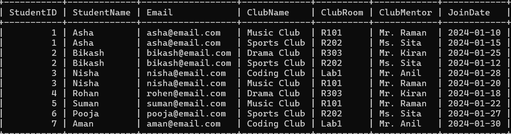
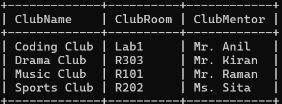
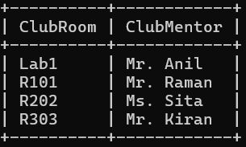
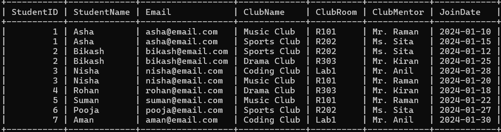

# Introduction 
Normalization is the systematic process of organizing a database to eliminate redundancy and protect data integrity. It involves decomposing "fat" tables into smaller, related ones to ensure every piece of data is stored in exactly one place. By following rules called Normal Forms (like 1NF, 2NF, and 3NF), you prevent "anomalies" where updating one record accidentally leaves old data elsewhere.

The process ensures that every non-key column depends strictly on the primary key, following the famous mantra: "The key, the whole key, and nothing but the key." While it makes "reads" slightly more complex due to table joins, it makes "writes" and updates significantly faster and more reliable. Ultimately, normalization transforms a messy spreadsheet into a clean, professional relational structure.

# tools used
1. docker 
2. my sql
 
# Quick start 
```text
git clone https://github.com/Prabesh-collab/Normalization-task-3.git
cd Normalization-task-3
```

# Setting up the docker.
We have to do certain steps to set up a mysql server in the docker.

## Step 1 : pulling the image in the docker and running it.
for that we have to use the command :
```text
docker pull mysql:8.0
```
## Step 2: running the image in the docker.
```text
 docker run -d -p 3306:3306 -e MYSQL_ROOT_PASSWORD=root --name mysql mysql:8.0
```
## Step 3: executing the mysql
```text
 docker exec -it mysql mysql -u root -p
  ```

# Normalizing the data.
This is the initial table.


# Normalizing the table in the 1NF
The table is already in the 1 NF form. so it is not necessary to normalize the table.



# Normalizing the table in the 2 NF Form.
The table still has partial dependencies like Studentname and student ID depend upon student. Not club. 

## Creaating seperate student table.
 

## Creating Clubs table.
 

## Creating Registrations table.


# Normalizing the table in the 3NF.
There are still transitive dependencies in the table. So we have to remove it to achieve true 3NF.

# Creating a seperate staff table.



# changing the club table.


The whole seoperated table as one looks like this.



